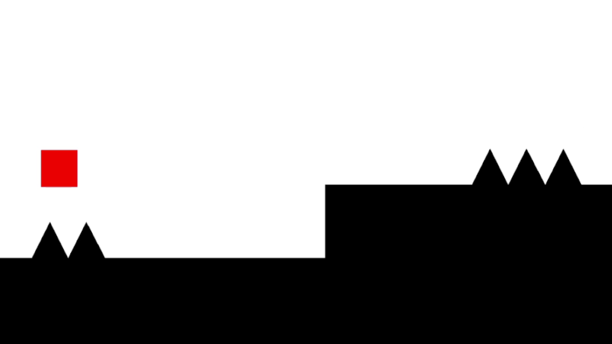

# Autoscroll Adventures

Autoscroll Adventures is a game inspired by a platformer  Geometry Dash. In Geometry Dash, the player is controlled with a single input, which can either make the player fly upwards, jump, or reverse gravity depending on the character.

[This video](https://www.youtube.com/watch?v=13i7GcfOYRk) explains the creation process of the video game, dividing it into four phases: planning, basic character movement, collision, and creating levels.

The game's features include:
* Two characters, one that jumps, one that flies
* Collision with platforms and spikes
* Three levels
* A progress bar and simple user interface
